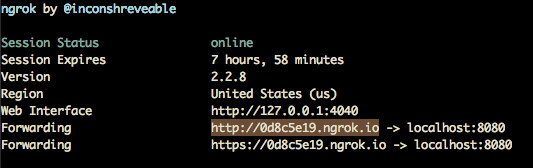
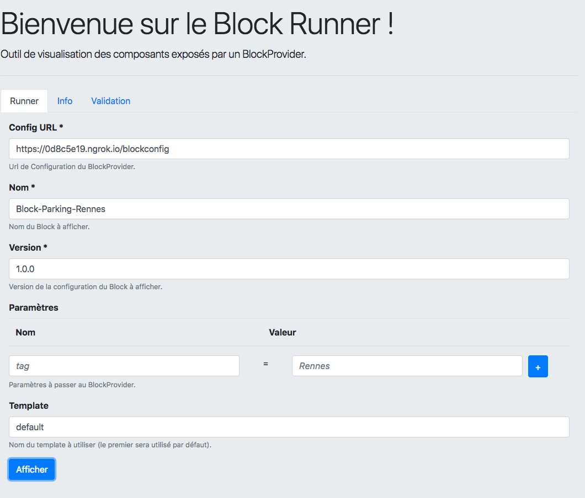

Ce guide décrit le développement d'un Block. Nous nous appuierons sur un cas d'usage réel : l'affichage des statuts des
parking de Rennes (ouverts ou pas, places disponibles ...). Pour récupérer les données en temps réel, nous utiliserons [l'API Open Data de Rennes Metropole](http://www.data.rennes-metropole.fr/espace-developpeurs/api-parking/).

Remarque : ce Block sera développé sous Spring Boot/Java mais la méthode utilisée ici peut être répliquée sur toute
plateforme ou langage.

# Ce dont vous avez besoin

- 30 minutes
- JDK 8 ou supérieur
- Maven 3
- Votre éditeur de texte ou IDE favori

# Développement du Block

## Configuration Maven

La configuration Maven est la suivante :

```xml
<?xml version="1.0" encoding="UTF-8"?>
<project xmlns="http://maven.apache.org/POM/4.0.0"
         xmlns:xsi="http://www.w3.org/2001/XMLSchema-instance"
         xsi:schemaLocation="http://maven.apache.org/POM/4.0.0 http://maven.apache.org/xsd/maven-4.0.0.xsd">
    <modelVersion>4.0.0</modelVersion>

    <groupId>fr.ouestfrance.platform</groupId>
    <artifactId>block-parkings-rennes</artifactId>
    <version>1.0-SNAPSHOT</version>

    <name>OF::Platform::Tutorial-BlockProvider</name>
    <description>OF::Platform::Tutorial-BlockProvider</description>

    <parent>
        <groupId>org.springframework.boot</groupId>
        <artifactId>spring-boot-starter-parent</artifactId>
        <version>2.0.5.RELEASE</version>
    </parent>

    <properties>
        <api.citedia>http://data.citedia.com/r1/parks</api.citedia>
    </properties>

    <dependencies>
        <dependency>
            <groupId>org.springframework.boot</groupId>
            <artifactId>spring-boot-starter-web</artifactId>
        </dependency>
        <dependency>
            <groupId>org.springframework.hateoas</groupId>
            <artifactId>spring-hateoas</artifactId>
            <version>0.25.0.RELEASE</version>
        </dependency>

        <dependency>
            <groupId>org.apache.commons</groupId>
            <artifactId>commons-lang3</artifactId>
            <version>3.8.1</version>
        </dependency>
        <dependency>
            <groupId>commons-io</groupId>
            <artifactId>commons-io</artifactId>
            <version>2.6</version>
        </dependency>
    </dependencies>

    <build>
        <plugins>
            <plugin>
                <groupId>org.jsonschema2pojo</groupId>
                <artifactId>jsonschema2pojo-maven-plugin</artifactId>
                <version>0.5.1</version>
                <configuration>
                    <useCommonsLang3>true</useCommonsLang3>
                </configuration>
                <executions>
                    <execution>
                        <id>ouestfrance-schemas</id>
                        <goals>
                            <goal>generate</goal>
                        </goals>
                        <configuration>
                            <sourcePaths>
                                <sourcePath>https://raw.githubusercontent.com/Ouest-France/platform/master/packages/schemas/BlockProviderConfig.json</sourcePath>
                                <sourcePath>https://raw.githubusercontent.com/Ouest-France/platform/master/packages/schemas/BlockData.json</sourcePath>
                                <sourcePath>http://swagger.io/v2/schema.json</sourcePath>
                            </sourcePaths>
                            <outputDirectory>${project.build.directory}/generated-sources</outputDirectory>
                            <targetPackage>fr.ouestfrance.platform.schemas.blocprovider</targetPackage>
                            <initializeCollections>false</initializeCollections>
                        </configuration>
                    </execution>
                    <execution>
                        <id>citedia-schemas</id>
                        <goals>
                            <goal>generate</goal>
                        </goals>
                        <configuration>
                            <sourcePaths>
                                <sourcePath>${api.citedia}</sourcePath>
                            </sourcePaths>
                            <sourceType>json</sourceType>
                            <outputDirectory>${project.build.directory}/generated-sources</outputDirectory>
                            <targetPackage>fr.ouestfrance.platform.schemas.citedia</targetPackage>
                            <initializeCollections>false</initializeCollections>
                        </configuration>
                    </execution>
                </executions>
            </plugin>
        </plugins>
    </build>

</project>
```

Nous appelons notamment le plugin jsonschema2pojo afin de générer les classes Java mappant les contrats d'interface BlockProvider :

- https://raw.githubusercontent.com/Ouest-France/platform/master/packages/schemas/BlockProviderConfig.json
- https://raw.githubusercontent.com/Ouest-France/platform/master/packages/schemas/BlockData.json
- http://swagger.io/v2/schema.json

Nous utilisons également ce plugin pour générer les classes correspondant à l'API Parking Rennes :

- http://data.citedia.com/r1/parks

## API BlockData

Une fois Maven configuré, la première étape consiste à définir le endpoint en charges de données du Block (ie. [BlockData](https://github.com/Ouest-France/platform/blob/master/BlockProvider-guide-fr.md#blockdata)).
Ce Block est chargé de renvoyer les données de rendu de Block ; ici, il s'agit de l'ensemble des données parking :

- Nom du parking
- Nombre de places maximum
- Nombre de places disponibles
- Parking plein ou pas
- Parking fermé ou pas

```java
package fr.ouestfrance.platform.domain;

public class ParkData {

    private String name;
    private boolean full = false;
    private boolean closed = false;
    private int available;
    private int max;
    
    ...
```

Le endpoint récupère simplement les données publiques sur l'API Citedia et les formatte au format BlockProvider :

```java
package fr.ouestfrance.platform.api;

import ...

@RestController
public class BlockDataController {

    private static final DateFormat DF = new SimpleDateFormat("dd-MM-yyyy HH:mm");

    @Value("${api.citedia.url}")
    private String apiCitediaURL;

    private RestTemplate restTemplate = new RestTemplate();

    @RequestMapping(value = "/blockdata", method = RequestMethod.GET)
    public BlockData getBlockData(@RequestParam(value = "parking", required = false) String name) {
        BlockData blockData = new BlockData();

        Internal internal = new Internal();
        blockData.setInternal(internal);

        Data data = new Data();
        internal.setData(data);

        data.setAdditionalProperty("date", DF.format(new Date()));

        List<ParkData> parkDataList = new ArrayList<>();
        data.setAdditionalProperty("parks", parkDataList);

        Parks parks = restTemplate.getForEntity(apiCitediaURL, Parks.class).getBody();
        for (Park park : parks.getParks()) {
            Map<String, Object> info = (Map) park.getParkInformation();

            if (info != null) {
                ParkData parkData = new ParkData();

                parkData.setName((String) info.get("name"));
                String status = (String) info.get("status");
                parkData.setFull(status.equals("FULL"));
                parkData.setClosed(status.equals("CLOSED"));
                parkData.setAvailable((Integer) info.get("free"));
                parkData.setMax((Integer) info.get("max"));

                if (org.apache.commons.lang3.StringUtils.isEmpty(name) || parkData.getName().equalsIgnoreCase(name)) {
                    parkDataList.add(parkData);
                }
            }
        }

        External_ external = new External_();
        blockData.setExternal(external);

        return blockData;
    }

}
```

Remarque : Il est possible de filtrer le BlockData par Parking afin de n'afficher qu'un parking dans le Block (ou tous si
le paramètre n'est pas valorisé).
   
## API BlockConfig

Le endpoint BlockConfig est en charge d'exposer le [contrat de notre BlockProvider](https://github.com/Ouest-France/platform/blob/master/BlockProvider-guide-fr.md#contrat-de-block) :

```java
package fr.ouestfrance.platform.api;

import ...

@RestController
public class BlockConfigController {

    private ObjectMapper objectMapper = new ObjectMapper();

    @RequestMapping(value = "/blockconfig", method = RequestMethod.GET)
    public List<BlockProviderConfig> getConfig() throws IOException {
        List<BlockProviderConfig> list = new ArrayList<>();

        BlockProviderConfig config = new BlockProviderConfig();
        list.add(config);

        // fiche Block
        config.setName("Block-Parking-Rennes");
        config.setType(BlockProviderConfig.Type.DISPLAY);

        // configuration Block
        List<Configuration> configurations = new ArrayList<>();
        config.setConfigurations(configurations);

        Configuration configuration = new Configuration();
        configurations.add(configuration);

        // configuration Block > version
        configuration.setVersion("1.0.0");

        // configuration Block > endpoint
        Endpoint endpoint = new Endpoint();
        configuration.setEndpoint(endpoint);

        ControllerLinkBuilder blockDataURLBuilder = ControllerLinkBuilder.linkTo(ControllerLinkBuilder.methodOn(BlockDataController.class).getBlockData(null));
        endpoint.setUrl(blockDataURLBuilder.toUri().toString());
        endpoint.setMethod(Endpoint.Method.GET);
        endpoint.setPure(true); // mise en cache des données pendant 1 heure

        // configuration Block > endpoint > parameters
        List<Object> parameters = new ArrayList<>();
        endpoint.setParameters(parameters);

        ObjectNode parameter = objectMapper.createObjectNode();
        parameters.add(parameter);

        parameter.put("name", "parking");
        parameter.put("required", false);
        parameter.put("in", "query");
        parameter.put("type", "string");

        // configuration Block > endpoint > ui
        Ui ui = new Ui();
        endpoint.setUi(ui);

        List<Section> sections = new ArrayList<>();
        ui.setSections(sections);

        Section section = new Section();
        sections.add(section);
        section.setTitle("Paramètres");
        section.setProperties(new Properties());

        PropertiesProperty properties = new PropertiesProperty();

        properties.setTitle("Parking");
        properties.setType("number");

        section.getProperties().getAdditionalProperties().put("parking", properties);
        
        // configuration Block > templates
        List<Template> templates = new ArrayList<>();
        configuration.setTemplates(templates);
        
        Template template = new Template();
        templates.add(template);

        template.setName("default");
        template.setEngine(Template.Engine.MUSTACHE);
        template.setSource(org.apache.commons.io.FileUtils.readFileToString(ResourceUtils.getFile("classpath:template.mustache"),"UTF-8"));
        template.setAssets(new Assets());
        List<Object> css = new ArrayList<>();
        template.getAssets().setCss(css);
        css.add(ControllerLinkBuilder.linkTo(getClass()).slash("parking.css").toUri());

        return list;
    }

}
```

La configuration expose notamment l'adresse du BlockData développé plus tôt, un fichier CSS parking.css (positionné dans l'arborescence du projet) mais aussi le template Mustache suivant :

```html
<div class="bp-parking">
    <div class="title">Parking Rennes - {{date}}</div>
    {{#parks}}
        {{^full}}
            {{^closed}}
                <div class="parking available tooltip-parking">{{name}}<span class="tooltip-parkingtext">{{max}} places max.</span> <div id="status">{{available}} place(s) disponible(s)</div></div>
            {{/closed}}
        {{/full}}
        
        {{#closed}}
            <div class="parking closed tooltip-parking">{{name}}<span class="tooltip-parkingtext">{{max}} places max.</span> <div id="status">Fermé</div></div>
        {{/closed}}
        
        {{#full}}
            <div class="parking full tooltip-parking">{{name}}<span class="tooltip-parkingtext">{{max}} places max.</span> <div id="status">Aucune place disponible</div></div>
        {{/full}}
    {{/parks}}
</div>
```

Enfin, afin de lancer notre Block, on ajoute une classe principale Spring Boot :

```java
package fr.ouestfrance.platform;

import ...

@SpringBootApplication
public class Application {

    public static void main(String[] args) {
        SpringApplication.run(Application.class, args);
    }

}
```

Notre projet final a alors la structure suivante :


## Tester le Block

Pour exécuter le Block localement, lancer la commande suivante :

```
~$ mvn package && java -jar target/block-parkings-rennes-1.0-SNAPSHOT.jar
```

Une fois le Block disponible, vous pouvez :

- afficher le contrat du Block

```
~$ curl http://localhost:8080/blockconfig

[
  {
    "name": "Block-Parking-Rennes",
    "type": "Display",
    "configurations": [
      {
        "version": "1.0.0",
        "endpoint": {
          "url": "http://localhost:8080/blockdata",
          "method": "GET",
          "pure": true,
          "parameters": [
            {
              "name": "parking",
              "required": false,
              "in": "query",
              "type": "string"
            }
          ],
          "ui": {
            "sections": [
              {
                "title": "Paramètres",
                "properties": {
                  "parking": {
                    "type": "number",
                    "title": "Parking"
                  }
                }
              }
            ]
          }
        },
        "templates": [
          {
            "name": "default",
            "engine": "mustache",
            "source": "<div class=\"bp-parking\">\n    <div class=\"title\">Parking Rennes - {{date}}</div>\n    {{#parks}}\n        {{^full}}\n            {{^closed}}\n                <div class=\"parking available tooltip-parking\">{{name}}<span class=\"tooltip-parkingtext\">{{max}} places max.</span> <div id=\"status\">{{available}} place(s) disponible(s)</div></div>\n            {{/closed}}\n        {{/full}}\n        \n        {{#closed}}\n            <div class=\"parking closed tooltip-parking\">{{name}}<span class=\"tooltip-parkingtext\">{{max}} places max.</span> <div id=\"status\">Fermé</div></div>\n        {{/closed}}\n        \n        {{#full}}\n            <div class=\"parking full tooltip-parking\">{{name}}<span class=\"tooltip-parkingtext\">{{max}} places max.</span> <div id=\"status\">Aucune place disponible</div></div>\n        {{/full}}\n    {{/parks}}\n</div>",
            "assets": {
              "css": [
                "http://localhost:8080/parking.css"
              ]
            }
          }
        ]
      }
    ]
  }
]
```

- tester le endpoint BlockData

```
~$ curl http://localhost:8080/blockdata

{
  "internal": {
    "data": {
      "date": "02-10-2018 10:06",
      "parks": [
        {
          "name": "Colombier",
          "full": false,
          "closed": false,
          "available": 567,
          "max": 1143
        },
        {
          "name": "Gare-Sud",
          "full": false,
          "closed": false,
          "available": 234,
          "max": 954
        },
        {
          "name": "Chézy-Dinan",
          "full": false,
          "closed": false,
          "available": 99,
          "max": 403
        },
        {
          "name": "Vilaine",
          "full": false,
          "closed": false,
          "available": 70,
          "max": 242
        },
        {
          "name": "Hoche",
          "full": false,
          "closed": false,
          "available": 376,
          "max": 776
        },
        {
          "name": "Centre Commercial Kennedy",
          "full": false,
          "closed": false,
          "available": 192,
          "max": 193
        },
        {
          "name": "Les Lices",
          "full": false,
          "closed": false,
          "available": 190,
          "max": 424
        },
        {
          "name": "Charles de Gaulle",
          "full": false,
          "closed": false,
          "available": 279,
          "max": 760
        },
        {
          "name": "Kléber",
          "full": false,
          "closed": false,
          "available": 102,
          "max": 394
        },
        {
          "name": "Arsenal",
          "full": false,
          "closed": false,
          "available": 217,
          "max": 605
        }
      ]
    }
  },
  "external": {}
}
```

- lancer le Block dans le BlockRunner

Remarque : afin d'exposer votre Block local sur une adresse accessible depuis le Block Runner, vous pouvez utiliser le service [ngrok](https://ngrok.com/)  par exemple
(ie. tunnel localhost).

```
~$ ngrok http 8080
```



Une fois le tunnel établi, il est alors possible de tester le Block au sein du Block Runner :

- Affichage des Blocks


- Rendu du Block



Et si tout s'est bien passé, vous devriez pouvoir visualiser le Block :


Le code du projet est disponible à [ici](../blockprovider-tutorial-parkings).


  